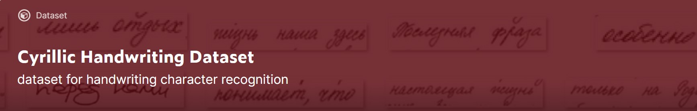
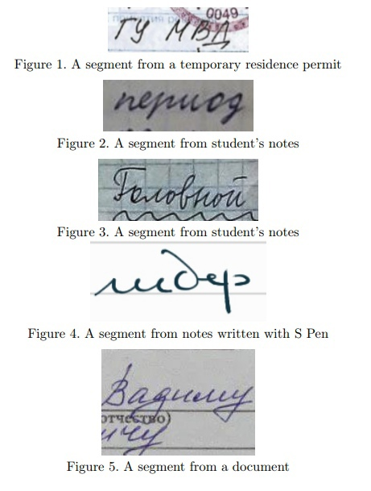
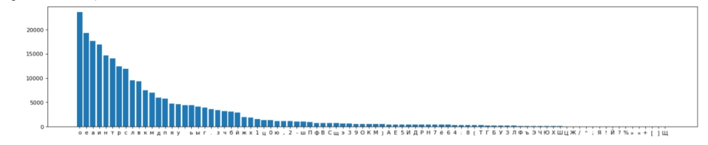
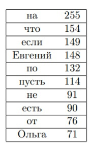
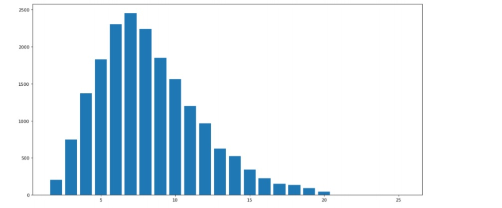

## Cyrillic Handwriting Dataset

---
[Download from kaggle](https://www.kaggle.com/constantinwerner/cyrillic-handwriting-dataset)
### Overview

We present a new dataset of Cyrillic handwriting for OCR tasks, which is composed of 33122 segments of handwriting texts (crops) in Russian and splited into train, and test sets with a split of 95% and 5%, respectively. The dataset is provided by SHIFT Lab CFT

---
### Description
The data was collected from open web sources and materials of members of the team. Each crop is an image of an expression in Russian of no more then 25 symbols written by hand.

---
Overall, there are 90 different symbols. The most common symbol is a small letter 'o'; meanwhile, the least common is a capital letter 'Щ'.

As for vocabulary, the dataset contains 18,955 unique expressions (w/o case of letters). Top 10 most common expressions:

The shortest expression consists of 1 symbol, whereas the longest one has 25 symbols, and the median is 7.

---
Check out kaggle notebooks:

[Explore Cyrillic Handwriting Dataset](https://www.kaggle.com/constantinwerner/explore-cyrillic-handwriting-dataset) 

[Starter model](https://www.kaggle.com/constantinwerner/resnet-transformer-cyrillic-handwriting) 

--- 
### Authors
The dataset is created by [SHIFTLab CFT]( https://team.cft.ru/start/lab) ML Team

