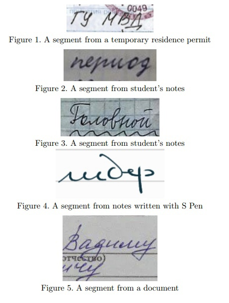
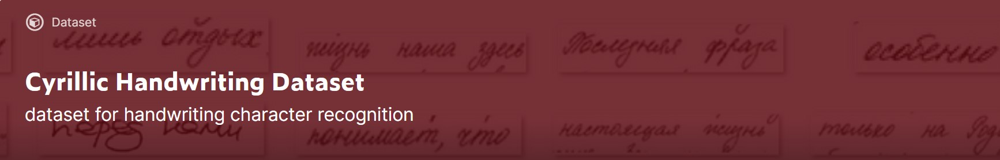

## Cyrillic Handwriting Dataset
### Overview
We present a new dataset of Cyrillic handwriting for OCR tasks, which is composed of 33122 segments of handwriting texts (crops) in Russian and splited into train, and test sets with a split of 95%, 5%, respectively. The dataset is provided by SHIFT Lab CFT

### Description
The data was collected from open web sources and materials of members of the team. Each crop is an image of an expression in Russian of no more then 25 symbols written by hand.

[Download from kaggle](https://www.kaggle.com/constantinwerner/cyrillic-handwriting-dataset)

Check out kaggle notebooks:

[Explore Cyrillic Handwriting Dataset](https://www.kaggle.com/constantinwerner/explore-cyrillic-handwriting-dataset) 

[Starter model](https://www.kaggle.com/constantinwerner/resnet-transformer-cyrillic-handwriting) 

### Authors
The dataset is created by [SHIFTLab CFT]( https://team.cft.ru/start/lab) ML Team

